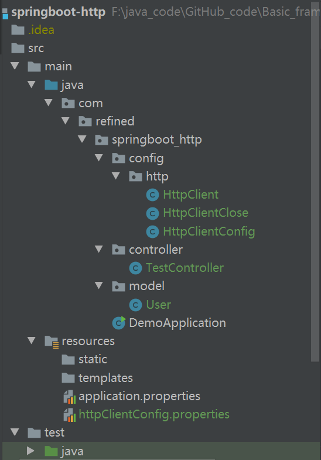
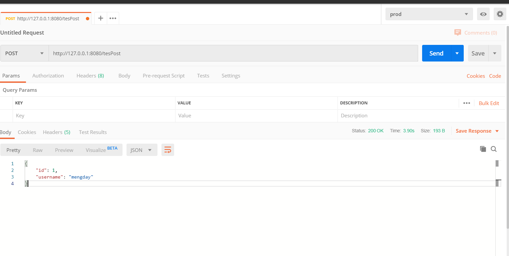

# SpringBoot整合HttpClient

### 1、引入依赖

```xml
<!-- https://mvnrepository.com/artifact/org.apache.httpcomponents/httpclient -->
        <dependency>
            <groupId>org.apache.httpcomponents</groupId>
            <artifactId>httpclient</artifactId>
            <version>4.5.12</version>
        </dependency>


 <!-- https://mvnrepository.com/artifact/com.alibaba/fastjson -->
        <dependency>
            <groupId>com.alibaba</groupId>
            <artifactId>fastjson</artifactId>
            <version>1.2.67</version>
        </dependency>

 <!-- https://mvnrepository.com/artifact/org.projectlombok/lombok -->
        <dependency>
            <groupId>org.projectlombok</groupId>
            <artifactId>lombok</artifactId>
            <version>1.18.12</version>
            <scope>provided</scope>
        </dependency>
```

### 2、httpClientConfig.properties 配置文件

```properties
#最大连接数
http.maxTotal = 100
#并发数
http.defaultMaxPerRoute = 20
#设置连接超时时间，单位毫秒
http.connectTimeout=2000
#从连接池中获取到连接的最长时间， clilent中从connetcion pool中获得一个connection的超时时间,单位毫秒
http.connectionRequestTimeout=5000
#数据传输的最长时间，请求获取数据的超时时间，单位毫秒。
http.socketTimeout=10000
#提交请求前测试连接是否可用
http.staleConnectionCheckEnabled=true
```

### 3、整合配置类

1、配置类 HttpClientConfig

```java
package com.refined.springboot_http.config.http;

import lombok.Data;
import org.apache.http.client.config.RequestConfig;
import org.apache.http.impl.client.CloseableHttpClient;
import org.apache.http.impl.client.HttpClientBuilder;
import org.apache.http.impl.conn.PoolingHttpClientConnectionManager;
import org.springframework.beans.factory.annotation.Qualifier;
import org.springframework.boot.context.properties.ConfigurationProperties;
import org.springframework.context.annotation.Bean;
import org.springframework.context.annotation.Configuration;
import org.springframework.context.annotation.PropertySource;

/**
 * @program: springboot-http
 * @description:
 * @author: urbane
 * @create: 2020-04-08 21:33
 **/
@Data
@Configuration
@PropertySource(value = "classpath:/httpClientConfig.properties")
@ConfigurationProperties(prefix = "http")
public class HttpClientConfig {
    /**
     * 最大连接数
     */
    // @Value("${http.maxTotal}")
    private Integer maxTotal;

    /**
     * 最大并发链接数
     */
    // @Value("${http.defaultMaxPerRoute}")
    private Integer defaultMaxPerRoute;

    /**
     * 创建链接的最大时间
     */
    // @Value("${http.connectTimeout}")
    private Integer connectTimeout;

    /**
     * 链接获取超时时间
     */
    // @Value("${http.connectionRequestTimeout}")
    private Integer connectionRequestTimeout;

    /**
     * 数据传输最长时间
     */
    // @Value("${http.socketTimeout}")
    private Integer socketTimeout;

    /**
     * 提交时检查链接是否可用
     */
    // @Value("${http.staleConnectionCheckEnabled}")
    private boolean staleConnectionCheckEnabled;

    /**
     * 定义httpClient链接池
     * 首先实例化一个连接池管理器，设置最大连接数、并发连接数
     *
     * @return
     */
    @Bean(name = "httpClientConnectionManager")
    public PoolingHttpClientConnectionManager getPoolingHttpClientConnectionManager() {
        PoolingHttpClientConnectionManager manager = new PoolingHttpClientConnectionManager();
        //设定最大链接数
        manager.setMaxTotal(maxTotal);
        //设定并发链接数
        manager.setDefaultMaxPerRoute(defaultMaxPerRoute);
        return manager;
    }


    /**
     * 实例化连接池，设置连接池管理器。
     * 这里需要以参数形式注入上面实例化的连接池管理器
     *
     * @Qualifier 指定bean标签进行注入
     */
    @Bean(name = "httpClientBuilder")
    public HttpClientBuilder getHttpClientBuilder(@Qualifier("httpClientConnectionManager") PoolingHttpClientConnectionManager httpClientConnectionManager) {

        //HttpClientBuilder中的构造方法被protected修饰，所以这里不能直接使用new来实例化一个HttpClientBuilder,可以使
        // 用HttpClientBuilder提供的静态方法create()来获取HttpClientBuilder对象
        HttpClientBuilder httpClientBuilder = HttpClientBuilder.create();
        httpClientBuilder.setConnectionManager(httpClientConnectionManager);
        return httpClientBuilder;
    }

    /**
     * 注入连接池，用于获取httpClient
     *
     * @param httpClientBuilder
     * @return
     */
    @Bean
    public CloseableHttpClient getCloseableHttpClient(@Qualifier("httpClientBuilder") HttpClientBuilder httpClientBuilder) {

        return httpClientBuilder.build();
    }

    /**
     * Builder是RequestConfig的一个内部类
     * 通过RequestConfig的custom方法来获取到一个Builder对象
     * 设置builder的连接信息
     * 这里还可以设置proxy，cookieSpec等属性。有需要的话可以在此设置
     * @return
     */
    @Bean(name = "builder")
    public RequestConfig.Builder getBuilder() {
        RequestConfig.Builder builder = RequestConfig.custom();
        return builder.setConnectTimeout(connectTimeout)
                .setConnectionRequestTimeout(connectionRequestTimeout)
                .setSocketTimeout(socketTimeout)
                .setStaleConnectionCheckEnabled(staleConnectionCheckEnabled);
    }

    /**
     * 使用builder构建一个RequestConfig对象
     *
     * @param builder
     * @return
     */
    @Bean
    public RequestConfig getRequestConfig(@Qualifier("builder") RequestConfig.Builder builder) {
        return builder.build();
    }
}

```

2、处理关闭连接的线程  HttpClientClose

```java
package com.refined.springboot_http.config.http;

import org.apache.http.impl.conn.PoolingHttpClientConnectionManager;
import org.apache.http.pool.PoolStats;
import org.springframework.beans.factory.annotation.Autowired;
import org.springframework.stereotype.Component;

import javax.annotation.PreDestroy;

/**
 * @program: springboot-http
 * @description:
 * @author: urbane
 * @create: 2020-04-08 21:36
 **/
//交给spring容器管理
@Component
public class HttpClientClose extends Thread {
    @Autowired
    private PoolingHttpClientConnectionManager manage;
    private volatile boolean shutdown; //开关 volatitle表示多线程可变数据,一个线程修改,其他线程立即修改

    public HttpClientClose() {
        ///System.out.println("执行构造方法,实例化对象");
        //线程开启启动
        this.start();
    }

    @Override
    public void run() {
        try {
            //如果服务没有关闭,执行线程
            while (!shutdown) {
                synchronized (this) {
                    wait(5000); //等待5秒
                    //System.out.println("线程开始执行,关闭超时链接");
                    //关闭超时的链接
                    PoolStats stats = manage.getTotalStats();
                    int av = stats.getAvailable(); //获取可用的线程数量
                    int pend = stats.getPending(); //获取阻塞的线程数量
                    int lea = stats.getLeased(); //获取当前正在使用的链接数量
                    int max = stats.getMax();
                    //System.out.println("max/"+max+": av/"+av+": pend/"+pend+": lea/"+lea);
                    manage.closeExpiredConnections();
                }
            }
        } catch (Exception e) {
            e.printStackTrace();
            throw new RuntimeException();
        }

        super.run();
    }

    //关闭清理无效连接的线程
    @PreDestroy //容器关闭时执行该方法.
    public void shutdown() {
        shutdown = true;
        synchronized (this) {
            //System.out.println("关闭全部链接!!");
            notifyAll(); //全部从等待中唤醒.执行关闭操作;
        }
    }
}

```

3、HttpClient 工具类

```java
package com.refined.springboot_http.config.http;

import com.alibaba.fastjson.JSONObject;
import org.apache.http.HttpHeaders;
import org.apache.http.HttpStatus;
import org.apache.http.client.config.RequestConfig;
import org.apache.http.client.methods.CloseableHttpResponse;
import org.apache.http.client.methods.HttpGet;
import org.apache.http.client.methods.HttpPost;
import org.apache.http.client.utils.URIBuilder;
import org.apache.http.entity.ContentType;
import org.apache.http.entity.StringEntity;
import org.apache.http.impl.client.CloseableHttpClient;
import org.apache.http.util.EntityUtils;
import org.springframework.beans.factory.annotation.Autowired;
import org.springframework.stereotype.Component;

import java.util.HashMap;
import java.util.Map;

/**
 * @program: springboot-http
 * @description:
 * @author: urbane
 * @create: 2020-04-09 08:59
 **/
@Component
public class HttpClient {

    /** 默认字符集 */
    public static final String DEFAULT_CHARSET = "UTF-8";

    @Autowired
    private CloseableHttpClient closeableHttpClient;

    @Autowired
    private RequestConfig config;


    /**
     * 用于JSON格式的API调用
     * @param url url地址
     * @param requestParameter  请求参数
     * @param clazz 接口返回值的类型
     * @return
     * @throws Exception
     */
    public <T> T doGet(String url, Map<String, Object> requestParameter, Class<T> clazz, HashMap<String, Object> header) throws Exception {
        String responseJson = this.doGet(url, requestParameter,header);
        T response = JSONObject.parseObject(responseJson, clazz);
        return response;
    }

    public String doGet(String url, Map<String, Object> requestParameter,HashMap<String, Object> header) throws Exception {
        URIBuilder uriBuilder = new URIBuilder(url);

        if (requestParameter != null) {
            for (Map.Entry<String, Object> entry : requestParameter.entrySet()) {
                uriBuilder.setParameter(entry.getKey(), entry.getValue().toString());
            }
        }

        return this.doGet(uriBuilder.build().toString(),header);
    }

    public String doGet(String url,HashMap<String, Object> header) throws Exception {
        HttpGet httpGet = new HttpGet(url);
        httpGet.setConfig(config);
        httpGet.addHeader(HttpHeaders.CONTENT_TYPE, ContentType.APPLICATION_JSON.getMimeType());
        // 设置头
        if (header != null && header.size() > 0) {
            for (Map.Entry<String, Object> entry : header.entrySet()) {
                httpGet.addHeader(entry.getKey(), entry.getValue().toString());
            }
        }
        CloseableHttpResponse response = this.closeableHttpClient.execute(httpGet);

        int statusCode = response.getStatusLine().getStatusCode();
        if (statusCode != HttpStatus.SC_OK) {
            throw new Exception("api request exception, http reponse code:" + statusCode);
        }

        return EntityUtils.toString(response.getEntity(), DEFAULT_CHARSET);
    }


    public <T> T doPost(String url, Map<String, Object> requestParameter, Class<T> clazz, HashMap<String, Object> header) throws Exception {
        HttpResponse httpResponse = this.doPost(url, requestParameter,header);
        int statusCode = httpResponse.getCode();
        if (statusCode != HttpStatus.SC_OK) {
            throw new Exception("api request exception, http reponse code:" + statusCode);
        }

        T response = JSONObject.parseObject(httpResponse.getBody(), clazz);
        return response;
    }

    public HttpResponse doPost(String url, Map<String, Object> requestParameter, HashMap<String, Object> header) throws Exception {
        HttpPost httpPost = new HttpPost(url);
        httpPost.setConfig(config);
        httpPost.addHeader(HttpHeaders.CONTENT_TYPE, ContentType.APPLICATION_JSON.getMimeType());
        // 设置头
        if (header != null && header.size() > 0) {
            for (Map.Entry<String, Object> entry : header.entrySet()) {
                httpPost.addHeader(entry.getKey(), entry.getValue().toString());
            }
        }
        if (requestParameter != null) {
            // List<NameValuePair> list = new ArrayList<NameValuePair>();
            // for (Map.Entry<String, Object> entry : map.entrySet()) {
            //     list.add(new BasicNameValuePair(entry.getKey(), entry.getValue().toString()));
            // }
            // // 构造from表单对象
            // UrlEncodedFormEntity urlEncodedFormEntity = new UrlEncodedFormEntity(list, "UTF-8");
            // // 把表单放到post里
            // httpPost.setEntity(urlEncodedFormEntity);

            String requestBody = JSONObject.toJSONString(requestParameter);
            StringEntity postEntity = new StringEntity(requestBody, "UTF-8");
            httpPost.setEntity(postEntity);
        }

        CloseableHttpResponse response = this.closeableHttpClient.execute(httpPost);
        // 对请求的响应进行简单的包装成自定义的类型
        return new HttpResponse(response.getStatusLine().getStatusCode(), EntityUtils.toString(
                response.getEntity(), DEFAULT_CHARSET));
    }


    public HttpResponse doPost(String url) throws Exception {
        return this.doPost(url, null,null);
    }


    /**
     * 封住请求的响应码和响应的内容
     */
    public class HttpResponse {
        /** http status */
        private Integer code;
        /** http response content */
        private String body;

        public HttpResponse() { }

        public HttpResponse(Integer code, String body) {
            this.code = code;
            this.body = body;
        }

        public Integer getCode() {
            return code;
        }

        public void setCode(Integer code) {
            this.code = code;
        }

        public String getBody() {
            return body;
        }

        public void setBody(String body) {
            this.body = body;
        }
    }
}

```

4、User

```java
package com.refined.springboot_http.model;

import lombok.AllArgsConstructor;
import lombok.Data;
import lombok.RequiredArgsConstructor;
import lombok.ToString;

/**
 * @program: springboot-http
 * @description:
 * @author: urbane
 * @create: 2020-04-09 09:03
 **/
@Data
@ToString
@AllArgsConstructor
@RequiredArgsConstructor
public class User {
    private Long id;
    private String username;
}

```

5、TestController

```java
package com.refined.springboot_http.controller;

import com.refined.springboot_http.config.http.HttpClient;
import com.refined.springboot_http.model.User;
import org.springframework.beans.factory.annotation.Autowired;
import org.springframework.web.bind.annotation.GetMapping;
import org.springframework.web.bind.annotation.PostMapping;
import org.springframework.web.bind.annotation.RequestBody;
import org.springframework.web.bind.annotation.RestController;

import java.util.HashMap;
import java.util.Map;

/**
 * @program: springboot-http
 * @description:
 * @author: urbane
 * @create: 2020-04-09 09:07
 **/
@RestController
public class TestController {
    @Autowired
    private HttpClient httpClient;

    @GetMapping("testGet")
    public String testGet() throws Exception {
        return httpClient.doGet("http://www.baidu.com",null);
    }

    @PostMapping("tesPost")
    public User tesPost() throws Exception {
        Map<String, Object> paramMap = new HashMap<>();
        paramMap.put("id", "1");
        paramMap.put("username", "mengda");
        User user = httpClient.doPost("http://localhost:8080/doPost", paramMap, User.class,null);
        return user;
    }

    @PostMapping("doPost")
    public User doPost(@RequestBody User user) {
        User newUser = new User(user.getId(), user.getUsername() + "y");
        return newUser;
    }
}

```


### 4、项目目录结构




### 5、测试



